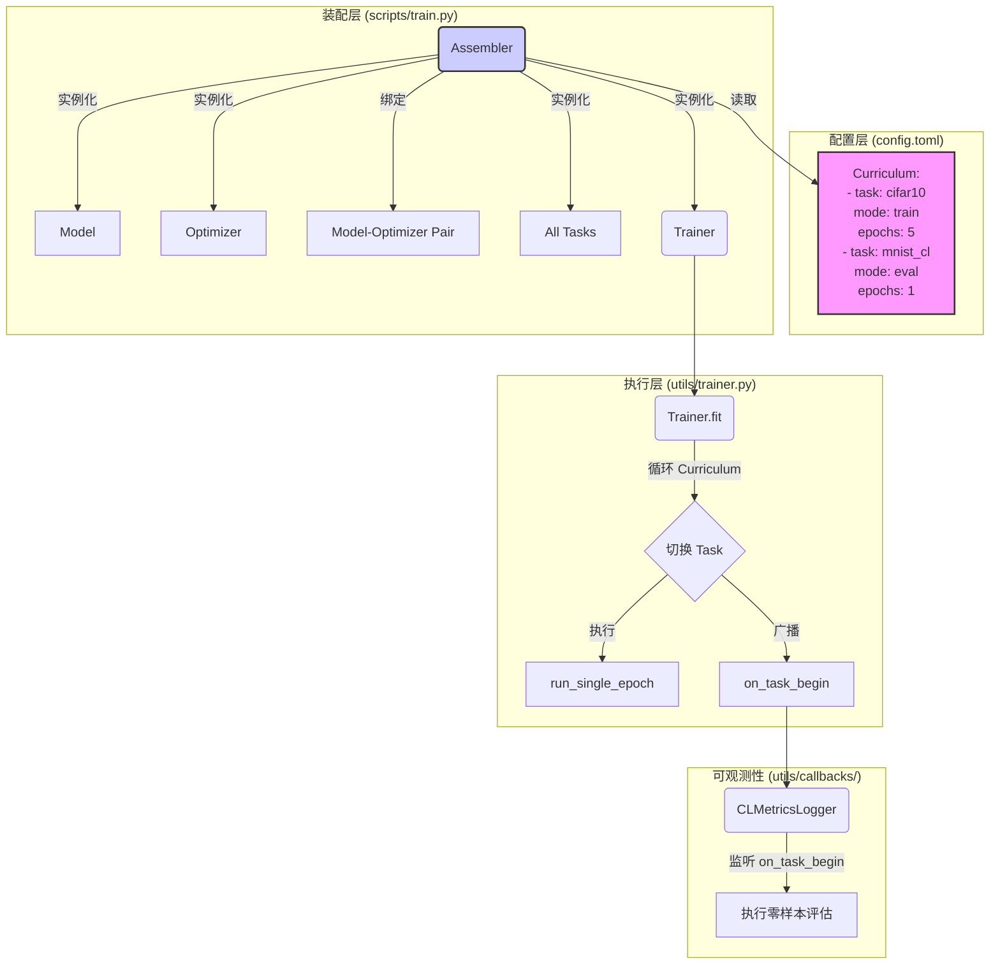

# F3EO-Bench 架构设计 v2.0：面向持续学习的演进

**版本**: 2.0  
**状态**: 设计完成  
**日期**: 2025-11-15

## 1. 目标

本架构旨在将 F3EO-Bench 从一个单任务实验框架，演进为一个支持任意复杂序列的**持续学习 (Continual Learning, CL) 研究平台**。核心目标是实现高度灵活的任务编排能力和对任务切换瞬间的精确可观测性，同时保持现有核心组件的模块化和可扩展性。

## 2. 核心问题

当前架构的主要瓶颈在于其“装配”逻辑混乱，且缺乏为 CL 场景设计的核心抽象，具体表现为：

1. **流程硬编码**: 训练流程被硬编码为“训练 N 个 epoch -> 验证”，无法轻松定义如“训练 A -> 验证 B -> 训练 C”等交错序列。
2. **职责耦合**: `scripts/train.py` 承担了过多的组装逻辑，与 `optimizer` 和 `task` 的内部实现深度耦合。
3. **观测粒度不足**: 无法精确测量任务切换瞬间（Task Switch）的性能变化，例如“零样本遗忘”程度，这是 CL 研究的关键指标。

## 3. 目标架构 (v2)

新架构的核心思想是**强化入口脚本的“装配”能力，并赋予 `Trainer` 遍历“课程表”的执行能力**，形成清晰的“Assembler-Trainer”模式。



### 3.1. 组件职责变更

#### 3.1.1. `Assembler` (入口脚本: `scripts/train.py`)

- **角色**: 实验的唯一**装配工**。
- **职责**:
    1. **解析配置**: 读取 `config.toml`，特别是新增的 `[[curriculum]]` 列表。
    2. **实例化单一模型-优化器对**: 创建在整个实验生命周期中**唯一且持久**的 `model` 和 `optimizer` 实例。
    3. **预实例化所有任务**: 根据 `curriculum` 中涉及的所有任务名称，提前实例化所有 `Task` 对象。这些 `Task` 对象是轻量级的，不持有模型状态。
    4. **注入依赖**: 创建 `Trainer` 实例，并将 `model`, `optimizer`, `tasks` 字典, `curriculum` 列表等所有依赖项注入。

#### 3.1.2. `Trainer` (强化的执行引擎: `utils/trainer.py`)

- **角色**: **课程表驱动的执行引擎**。
- **职责**:
    1. `fit` 方法接收 `curriculum` 列表，并成为新的主流程控制器。
    2. **外层循环**: 遍历 `curriculum` 中的每一个“任务块”。
    3. **任务切换**: 在每个任务块开始时，从预实例化的任务字典中获取当前 `Task` 对象。
    4. **广播新事件**: 广播 `on_task_begin` 事件，为精确测量提供钩子。
    5. **内层循环**: 根据任务块定义的 `epochs` 数，多次调用内部的 `_run_single_epoch` 方法。

#### 3.1.3. `Task` (轻量化抽象: `task/base.py`)

- **角色**: **任务规约**，定义了任务的数据、评估方式和特定参数。
- **职责变更**:
    1. **去状态化**: 不再负责创建或持有 `model` 和 `optimizer`。
    2. **引入 `mode`**: 增加一个 `mode` 属性 (`"train"` 或 `"eval"`)。`Trainer` 将根据此模式决定是执行训练+验证循环，还是只执行验证循环。这以一种通用的方式实现了 `PureEvalTask` 的思想。

#### 3.1.4. `CLMetricsLogger` (新的可观测性回调)

- **角色**: **持续学习关键指标记录器**。
- **职责**:
    1. 监听 `on_task_begin` 事件。
    2. 在事件触发时，立即使用当前 `Task` 的验证集对全局 `model` 进行一次**零样本评估**，记录任务切换瞬间的性能。
    3. 监听 `on_step_end` 事件，但仅在 `step_in_epoch == 0` 时触发，记录新任务**第一个训练步骤的损失**。

### 3.2. 核心数据结构与接口

#### 3.2.1. `config.toml`

```toml
# ... (其他配置)

[[curriculum]]
task = "cifar10"
mode = "train"
epochs = 5

[[curriculum]]
task = "mnist_cl"
mode = "eval"
epochs = 1 # 对于 eval 模式，epochs 通常为 1

[[curriculum]]
task = "fashion_cl"
mode = "train"
epochs = 3
```

#### 3.2.2. `callbacks/base.py`

需要新增以下抽象方法：

```python
@abstractmethod
def on_task_begin(self, task_name: str, task_mode: str, **kwargs):
    """Called before a new task block in the curriculum begins."""
    pass

@abstractmethod
def on_task_end(self, task_name: str, **kwargs):
    """Called after a task block in the curriculum ends."""
    pass
```

## 4. 实施优势

1. **演进式重构**: 在现有 `Trainer` 基础上扩展，避免了引入全新顶层对象的颠覆性变更，降低了实现复杂度和风险。
2. **职责单一**: `Assembler`, `Trainer`, `Task` 各司其职，代码结构更清晰，易于维护和扩展。
3. **CL 需求满足**: 灵活的课程表、精确的任务切换测量机制，为严肃的持续学习研究提供了强大的基础支持。
